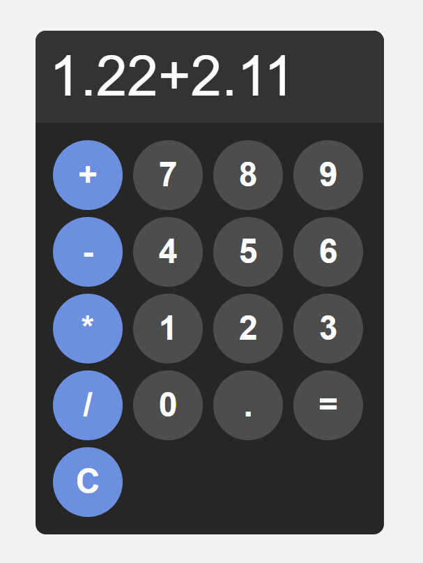
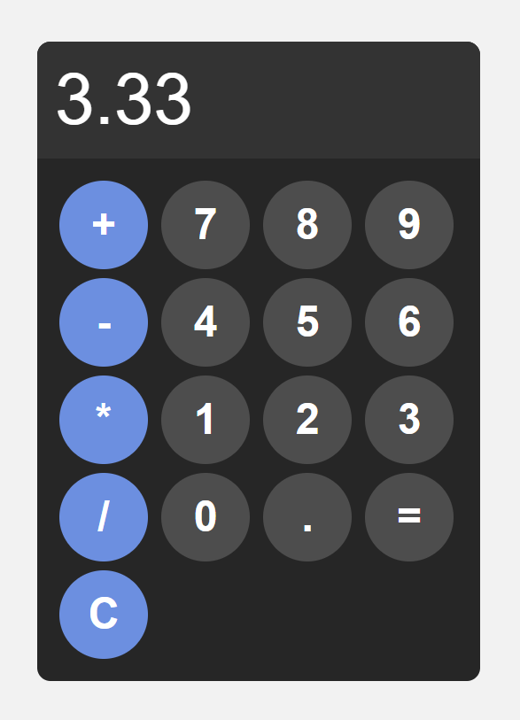
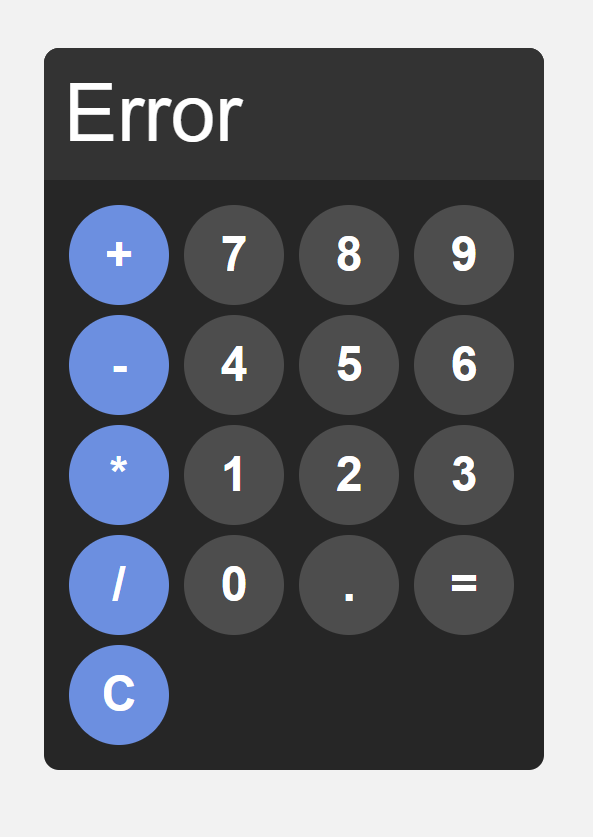

# Simple Calculator // HTML, CSS & JavaSc

This is a simple calculator application built using HTML, CSS, and JavaScript. It provides basic calculations such as addition, subtraction, multiplication, and division.

### Features

- Perform basic math operations (add, subtract, multiply, divide).
- Clear input functionality.
- Responsive design suitable for different screen sizes.
- Simple and user-friendly interface.
- Error handling for invalid operations (e.g., pressing 7 + =).

### Preview

You can try the live demo here: [Live Demo](https://roosahoo.github.io/calculator/)

  
  

### Usage

Use the buttons on the calculator interface to input numbers and operations.

Click = to see the result of the calculation.

Press C to clear the input field.

If your input is invalid, an error occurs.

 

